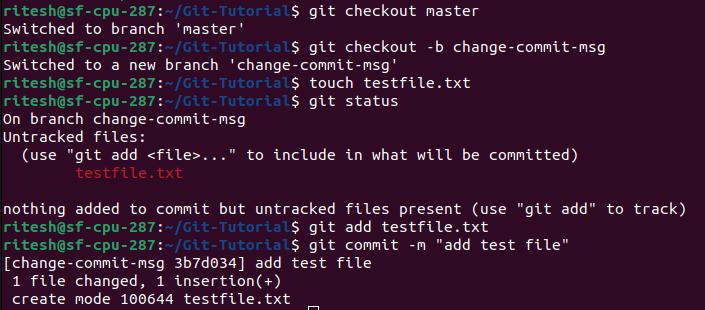
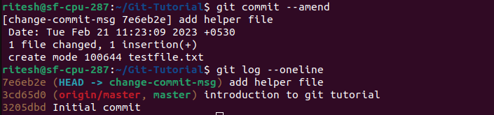

## Changing commit message

- Step 1 : Creating a new branch, add a file and commit changes

Viewing the commit message in the history:

- Step 2 : Use the `git commit --amend` command to change the name and save the changes. Check the updated commit message - previously it was "add test file" and then changed to "add helper file"

