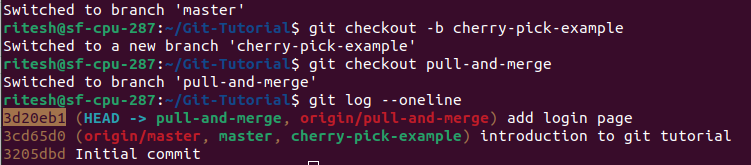
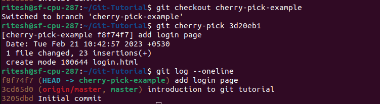

## cherry-pick

- Step 1 : Create a new branch and then check the commit that you want to add to this branch. Here we want to add the login page from the branch "pull-and-merge". \

- Step 2 : We copy the commit id of that commit and then use the `cherry-pick` command to add that feature to our current branch i.e. "cherry-pick-example" \
