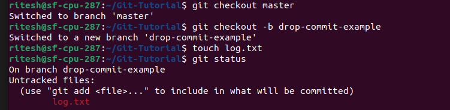
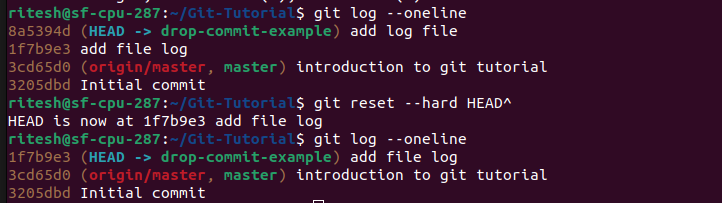

## drop commit

- Step 1 : Create a new branch, add some files and commit changes. \
 \
After the commits made, the history is as follow:

- Step 2 : Drop the commit using `git reset --hard HEAD^` command. The history displays thats the commit has been dropped: \
