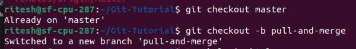
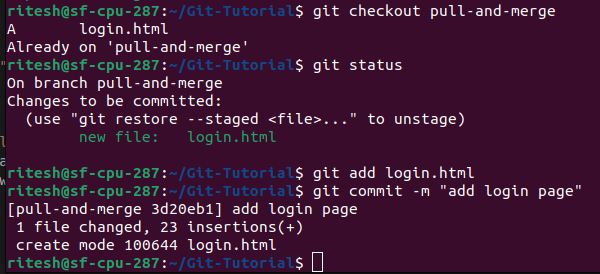
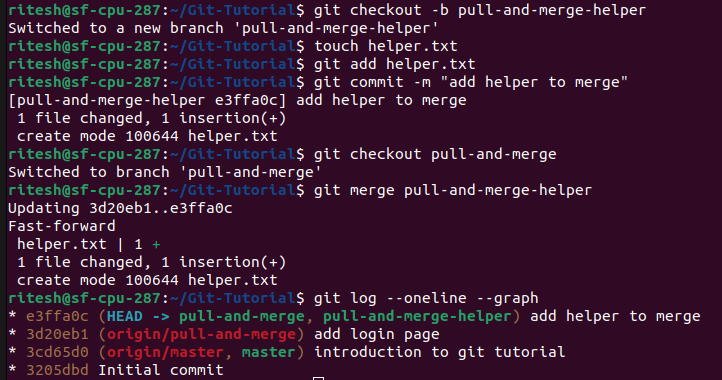

## Pull
- The `git pull` command is used to fetch and download content from a remote repository and immediately update the local repository to match that content. 
- The git pull command first runs git fetch which downloads content from the specified remote repository. 
- Then a git merge is executed to merge the remote content refs and heads into a new local merge commit.
- Command : `git pull origin master`

## Merge
- The `git merge` command lets you take the independent lines of development created by git branch and integrate them into a single branch.
- The current branch will be updated to reflect the merge, but the target branch will be completely unaffected. 
- This means that git merge is often used in conjunction.

- Step 1 : Create a new branch, add some files and commit.

- Step 2 : To show the implementation, first we create a helper branch which will be merged to the base branch i.e. pull-and-merge

