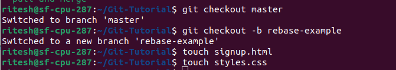
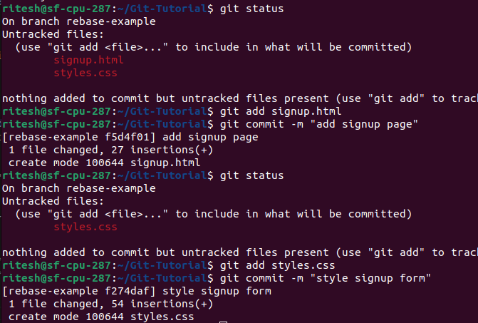
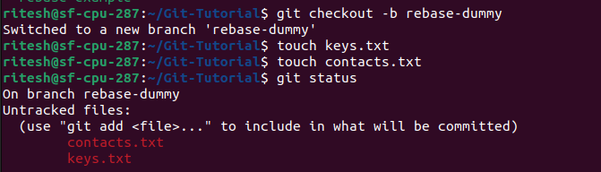
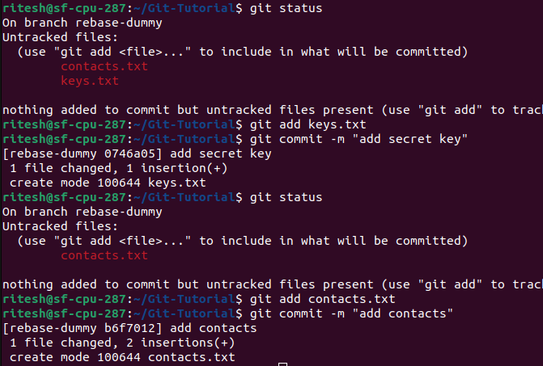
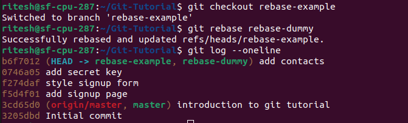

## Rebase 

- Step 1 : Create a branch that will be the base branch. Add some files and commit changes.

- Step 2 : Create a dummy branch that is to be based on the same commit line of the base branch(here base branch is rebase-example) and add some files and commit changes.

- Step 3 : chekout to base branch and rebase underlying branch

